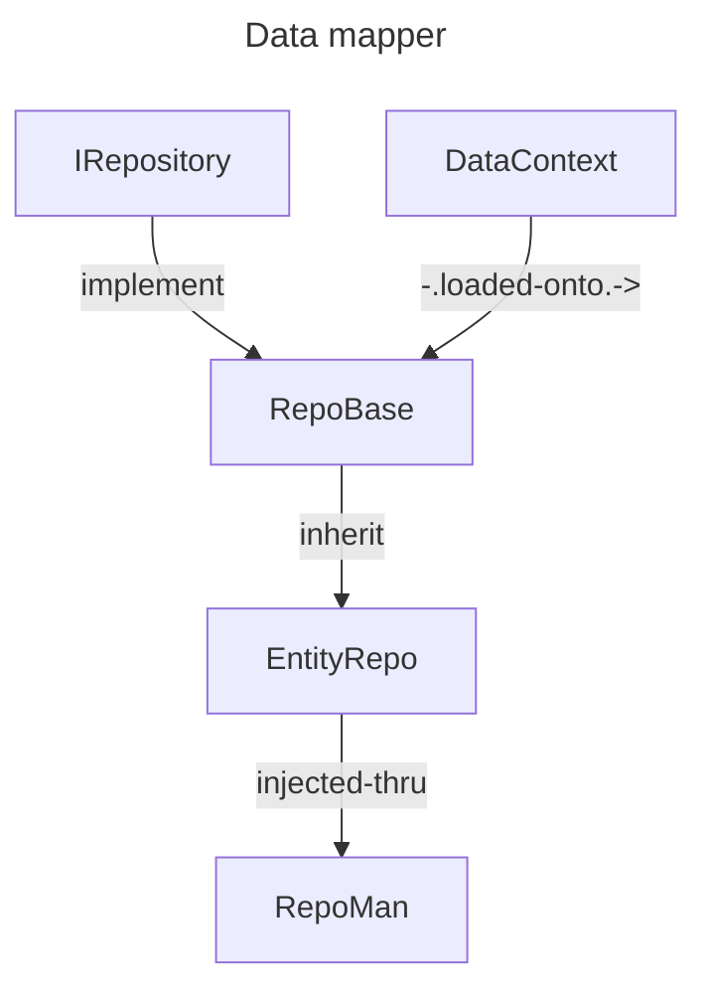

# C#/.Net + Blazor 

> [!note]
> As a project, this is essentially the foundations for a homebrew ORM - a simple learning WIP tool.
> Bullet items with ~~strikethrough~~ represent unfinished tasks.

#### This repo attempts to demonstrate use of following C#/.Net, and to some extent, some relevant CS concepts through a Blazor webapp project in .Net 8:

### Types
- use of compound data types
    - structs
    - classes
    - records 
    - generics
    - ~~anonymous types~~
    - ~~boxing/unboxing~~

### Data Structures / Algo's
- enumerables/collections
- ~~Graphs and Trees~~
- ~~recursion~~
- Binary search tree

### Control flow
- conditionals

### OOP
- polymorphism
- composition/inheritance
- abstract/virtual members
- access modifiers:
    - private, protected, internal, public, sealed

### Design patterns
- Inversion of Control
- Repository
- Adapter
- Decorator (extension methods)

#### .NET Libraries
- LINQ
- EF Core

### Concurrent programming
- async/await using Task

### Blazor
- Interactive SSR render mode
- ~~Interactive WASM (webassembly)~~
- ~~Interactive AUTO~~

### ~~Testing~~ (yet to write tests)
- libs: xUnit, NUnit
- unit
- integration
- regression

### ~~Big-O~~ (demonstrate with algo's)
- Best: constant time
- Good: O(Logn), linear, O(nLogn)
- Bad: quadratic, exponential

